# Reverse Proxy - Advanced Go Implementation

[](https://github.com/surukanti/reverse-proxy/actions/workflows/go.yml)
[](https://goreportcard.com/report/github.com/surukanti/reverse-proxy)
[](https://opensource.org/licenses/MIT)
[](https://golang.org/)

A production-ready, feature-rich reverse proxy for Go supporting 10 different use cases with advanced networking capabilities.

## 🎯 Features

### Core Functionality
- **Path-based routing**: Route requests based on URL paths
- **Subdomain-based routing**: Route based on subdomain (for multi-tenant applications)
- **Header-based routing**: Route based on request headers
- **Regex pattern matching**: Complex route matching with regular expressions
- **Priority-based routing**: Control route matching order with priorities

### Load Balancing & Health
- **Round-robin load balancing**: Distribute requests evenly across backends
- **Health checking**: Automatic health status monitoring of backend servers
- **Failover**: Automatically skip unhealthy servers
- **Connection pooling**: Efficient HTTP connection management

### Middleware & Security
- **Request logging**: Detailed HTTP request/response logging
- **Rate limiting**: Token bucket algorithm for rate limiting
- **CORS support**: Configure CORS headers and policies
- **Authentication proxy**: JWT, API Key, and Basic auth support
- **Middleware chain**: Extensible middleware system

### Advanced Features
- **Response caching**: Cache responses with configurable TTL
- **A/B testing**: Route users to different variants consistently
- **Blue-Green deployments**: Gradual traffic shifting between versions
- **Circuit breaker**: Handle backend failures gracefully
- **Per-tenant rate limiting**: Separate limits for different tenants
- **Event system**: Hook into proxy events for monitoring

## 📋 10 Use Cases Implemented

1. **Microservices API Gateway** - Route requests to different services
2. **Blue-Green Deployments** - Gradually shift traffic between versions
3. **Multi-Tenant SaaS** - Route by subdomain or headers
4. **Development Proxy** - Local development routing
5. **Legacy Migration** - Gradual monolith to microservices migration
6. **CDN Origin Shield** - Origin protection and consolidation
7. **Authentication Proxy** - Add auth to services without built-in auth
8. **Internal Tools** - Consolidate multiple tools behind single URL
9. **A/B Testing** - Route users to different variants
10. **Protocol Translation** - Convert between HTTP versions and protocols

## 🚀 Quick Start

### Building

```bash
# Build the proxy binary
go build -o bin/proxy ./cmd/proxy
```

### Running

```bash
# Run with use case config
./bin/proxy -config examples/1-microservices-gateway.yaml
./bin/proxy -config examples/2-blue-green-deployment.yaml
# ... and so on
```

## 🤖 CI/CD & Automation

### GitHub Actions Workflows

This project uses GitHub Actions for automated testing, building, and secure releases:

- **Go CI** - Automated testing and building on every push/PR to `main`
  - Runs `go build -v ./...` and `go test -v ./...`
  - Tests on Ubuntu with Go 1.24.2
  - Ensures code quality and prevents regressions

- **Docker Image CI** - Automated Docker image building
  - Builds Docker image on every push/PR to `main`
  - Validates Dockerfile and build process
  - Ensures containerization works correctly

- **SLSA3 Release** - Secure software supply chain for releases
  - Generates provenance attestations for releases
  - Uses OpenSSF SLSA framework for build security
  - Triggered on release creation or manual dispatch

### Development Commands

```bash
# Quick development cycle
make build          # Build the binary
make test           # Run all tests
make coverage       # Generate coverage report
make fmt            # Format code
make lint           # Run linter

# Docker development
make build-docker   # Build Docker image
make run-docker     # Run in Docker
make test-docker    # Test Docker container

# Full stack development
make run-compose    # Run with Docker Compose
make logs-compose   # View all logs
```

## 📁 Example Configurations

All 10 use cases have complete configuration files in `examples/`:

- `1-microservices-gateway.yaml` - API Gateway pattern
- `2-blue-green-deployment.yaml` - Deployment strategy
- `3-multi-tenant-saas.yaml` - SaaS routing
- `4-dev-environment-proxy.yaml` - Development proxy
- `5-legacy-migration.yaml` - Gradual migration
- `6-cdn-origin-shield.yaml` - CDN shield
- `7-auth-proxy.yaml` - Authentication proxy
- `8-internal-tools.yaml` - Tool consolidation
- `9-ab-testing.yaml` - A/B testing
- `10-protocol-translation.yaml` - Protocol conversion
- `11-basic-nginx-backends.yaml` - Docker setup with nginx backends

## 🔧 Key Configuration Features

- **Path-based routing** with prefix matching
- **Subdomain-based routing** for multi-tenant apps
- **Rate limiting** with token bucket algorithm
- **CORS policies** per route
- **Authentication** (JWT, API Key, Basic)
- **Response caching** with TTL
- **Health checking** for backends
- **Load balancing** across multiple servers

## 📁 Project Structure

```
internal/
├── proxy/          # Core proxy engine, A/B testing, blue-green deployments
├── router/         # Request routing logic
├── backend/        # Backend pool management and health checks
├── middleware/     # Logging, rate limiting, auth, CORS
└── config/         # Configuration loading (YAML/JSON)

cmd/proxy/          # Main entry point
examples/           # 10 configuration examples for each use case
```

## 🏗️ Architecture Diagram

```mermaid
graph LR
    Client[Client] --> RP[Reverse Proxy]
    RP --> MW[Middleware<br/>Auth • CORS • Logging • Rate Limit]
    MW --> Router[Router<br/>Path • Subdomain • Header • Regex]
    Router --> LB[Load Balancer<br/>Round Robin]
    LB --> Backend1[Backend Service 1]
    LB --> Backend2[Backend Service 2]
    LB --> BackendN[Backend Service N]

    Router -.-> Cache[(Response Cache)]
    RP -.-> Events[Event System<br/>Monitoring • Metrics]
    RP -.-> Advanced[A/B Testing<br/>Blue-Green<br/>Circuit Breaker]

    classDef primary fill:#e3f2fd
    classDef secondary fill:#f3e5f5
    classDef backend fill:#e8f5e8

    class Client,RP primary
    class MW,Router,LB secondary
    class Backend1,Backend2,BackendN backend
```



## 🔐 Security Features

- JWT/API Key authentication
- CORS policy enforcement
- Rate limiting per client
- TLS/HTTPS support
- Secure header injection
- Per-tenant isolation

## 📊 Monitoring

Event system for:
- Request forwarding
- Cache hits
- Errors and failures
- Rate limit exceeded
- Backend health changes

## 📝 License

MIT License
